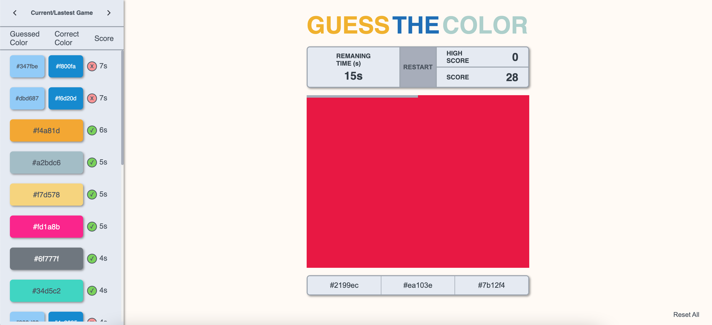
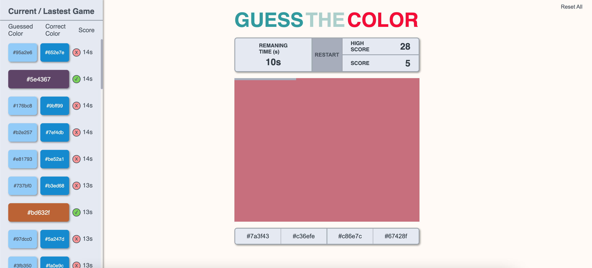
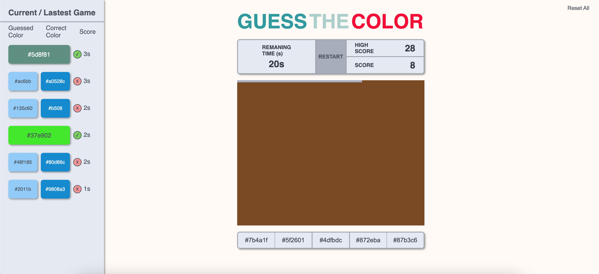
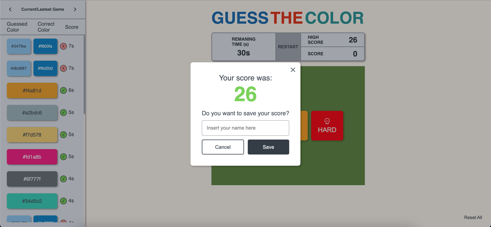
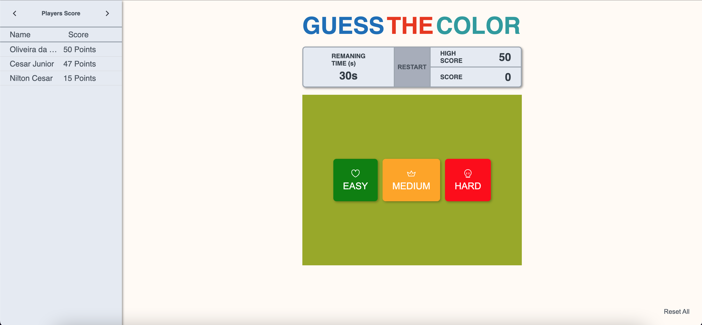

# PROJECT DOCUMENTATION

### Porque das tecnologias?

💅 **Styled Components:**

Styled Components é uma biblioteca feita para React e React Native. Ela utiliza uma mistura de CSS e Javascript usando uma técnica chamada CSS-in-JS.

- Global Stylesheet
- Adaptação baseada em props
- Extensão de estilos
- Temas

🚥 **Zustand:**

Zustand é uma solução de gestão de estados pequenos, rápida e escalonável. Sua gestão de estado é centralizada e baseada em ações.

- Código menos repetição (comparado com Redux).
- Flexibilidade
- Não envolve a aplicação em um provedor, como normalmente é feito no Redux.
- Re-renderiza os componentes apenas quando houver mudanças.

### Aplicação

#### EASY MODE

#### MEDIUM MODE

#### HARD MODE

#### MODAL

#### PLAYER SCORE

- A lista se organiza pela pontuação
