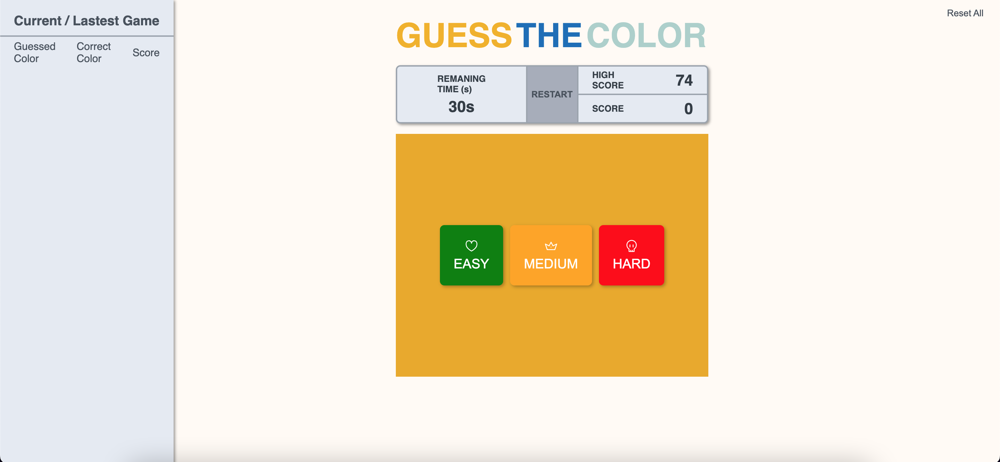

# PROJECT DOCUMENTATION



### Estrutura de diretorios

```shell
├── .github
├── public
├   ├── next.svg
├   ├── thirteen.svg
├   ├── vercel. svg
├── src
├   ├── @types
├   ├   ├── types.d.ts
├   ├── api
├   ├   ├── index.ts
├   ├── app
├   ├   ├── favicon.ico
├   ├   ├── layout.tsx
├   ├   ├── page.tsx
├   ├   ├── registry.tsx
├   ├── assets
├   ├   ├── crown-alt.svg
├   ├   ├── heart-half-vertical.svg
├   ├   ├── skull.svg
├   ├── components
├   ├   ├── Button
├   ├   ├── ButtonGroup
├   ├   ├── ScoreBoard
├   ├   ├── ScoreHistory
├   ├   ├── ScrollSection
├   ├   ├── Sidebar
├   ├   ├── SquareGameColor
├   ├   ├── Title
├   ├── store
├   ├   ├── useGlobalSotre
├   ├   ├── usePersistedHighScore
├   ├── styles
├   ├   ├── theme
├       ├   ├── index.ts
├   ├   ├── global.ts
├   ├── utils
├   ├   ├── constants
├   ├   ├── randomColorOptionsGenerator
├   ├   ├── storage
├   ├   ├── timer
├── .eslintrc.json
├── .gitignore
├── .prettierignore
├── .prettierrc
├── LICENSE
├── next.config.js
├── package-lock.json
├── package.json
├── README.md
├── tsconfig.json
├── yarn.lock
```

### Porque das tecnologias?

💅 **Styled Components:**

Styled Components é uma biblioteca feita para React e React Native. Ela utiliza uma mistura de CSS e Javascript usando uma técnica chamada CSS-in-JS.

- Global Stylesheet
- Adaptação baseada em props
- Extensão de estilos
- Temas

🚥 **Zustand:**

Zustand é uma solução de gestão de estados pequenos, rápida e escalonável. Sua gestão de estado é centralizada e baseada em ações.

- Código menos repetição (comparado com Redux).
- Flexibilidade
- Não envolve a aplicação em um provedor, como normalmente é feito no Redux.
- Re-renderiza os componentes apenas quando houver mudanças.

### Dificuldades da aplicação

#### EASY MODE


#### MEDIUM MODE


#### HARD MODE


