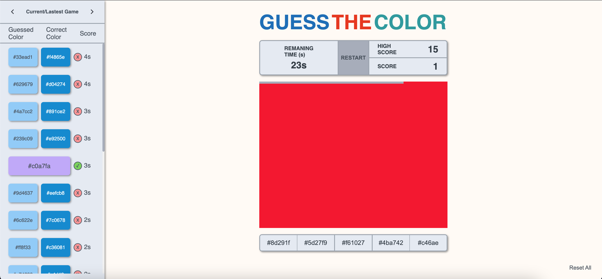

# PROJECT DOCUMENTATION

### Choice of Technologies

💅 **Styled Components:**

Styled Components is a library designed for React and React Native. It uses a blend of CSS and JavaScript through a technique called CSS-in-JS.

- Global Stylesheet
- Prop-based Adaptation
- Style Extension
- Theming

🚥 **Zustand:**

Zustand is a small, fast, and scalable state management solution. Its state management is centralized and action-based.

- Less repetitive code compared to Redux.
- Flexibility
- Doesn't require wrapping the application in a provider, as is typically done in Redux.
- Re-renders components only when changes occur.

### Application

#### EASY MODE

#### MEDIUM MODE

#### HARD MODE

#### MODAL

#### PLAYER SCORE

- The list is organized by score.
